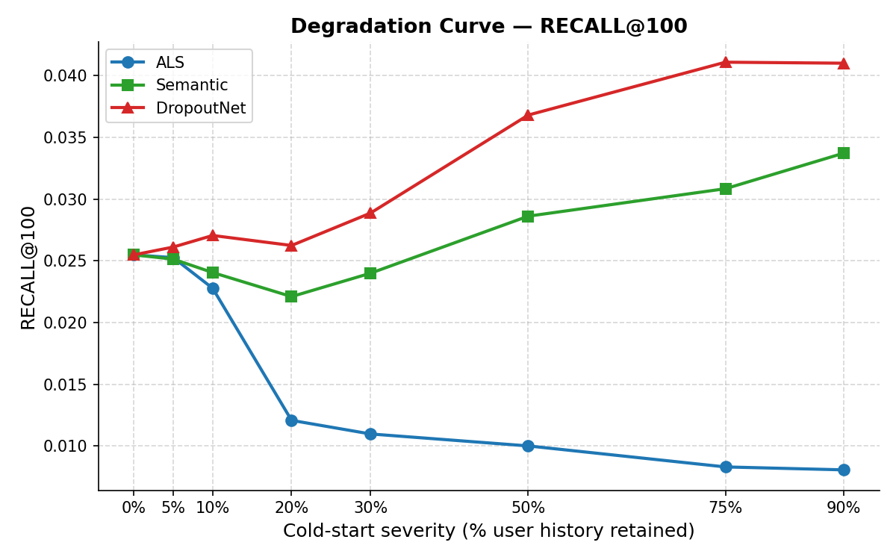
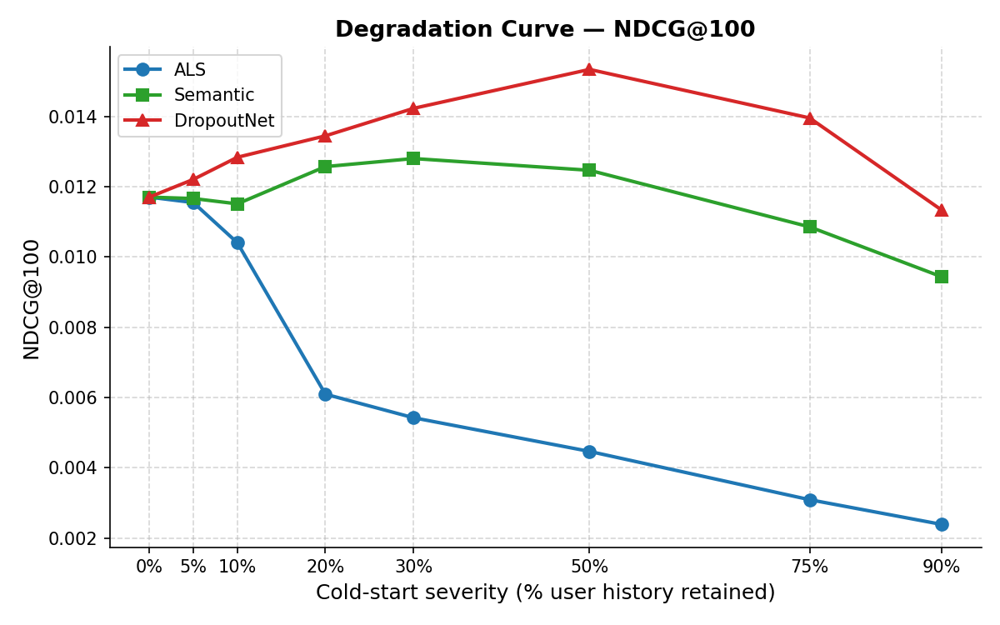

# ColdBrew: From Zero to Warm — A Cold-Start Benchmark on Amazon Books

Most recommendation benchmarks evaluate models at a single point, either a fully cold user or a fully warm one. This project treats cold-start as a continuous spectrum. We evaluate three models across eight severity levels from K=0% (no history) to K=90% (nearly warm) and identify exactly where each model's advantage begins and ends.

---

## Models

| Model | Type | Cold-start strategy |
|---|---|---|
| ALS | Collaborative filtering | Fold-in from seed interactions |
| Semantic Embedding | Content-based | Sentence-BERT item similarity |
| DropoutNet | Hybrid (ALS + SBERT) | Preference dropout during training |

---

## Results

### Recall@100



### NDCG@100



### Key Finding

All three models start equal at K=0 since no user-specific signal is available. DropoutNet pulls ahead of ALS at K=5 and leads across the full spectrum, peaking at Recall@100 of 0.0411 at K=75. ALS degrades consistently as more history is revealed, dropping 68% on recall by K=90. Semantic Embedding is stable and improves throughout, making it a strong fallback when no interaction data is available.

### Model Selection Guide

| User history available | Recommended model |
|---|---|
| K=0 (no history) | Any, all models are equivalent |
| K=5 onwards | DropoutNet |
| New items with no interaction data | Semantic Embedding |
| Fully warm users only | ALS |

---

## Dataset

Amazon Books (2023) via Hugging Face `McAuley-Lab/Amazon-Reviews-2023`

| | |
|---|---|
| Users | 38,637 |
| Items | 594,029 |
| Train interactions | 1,194,596 (80%) |
| Test interactions | 181,355 (20%) |
| Total interactions | 1,375,951 |
| Interaction density | 0.0060% |

The dataset is highly sparse, on average each user has rated only 36 out of 594,029 available books. For evaluation, only test interactions with a rating of 4 or above are counted as relevant, giving an average of 4.3 relevant items per user.

---

## Pipeline

```
python main.py                                          # full run
python main.py --skip-preprocess --skip-embeddings     # retrain models only
python main.py --skip-preprocess --skip-train          # re-evaluate only
```

### Steps

1. **Preprocess**: load and clean data, build user/item index maps
2. **Embeddings**: encode item text with Sentence-BERT (memory-mapped)
3. **Train**: ALS (PySpark), Semantic Embedding, DropoutNet (PyTorch)
4. **Evaluate**: cold-start simulation across K levels, Recall@100 / NDCG@100
5. **Analyze**: degradation curves, crossover detection, plots

---

## Project Structure

```
coldbrew-recommendation-systems-study/
├── main.py                        # Full pipeline entry point
├── requirements.txt
├── src/
│   ├── preprocess.py              # Data loading, cleaning, index mapping
│   ├── embeddings.py              # Sentence-BERT item embeddings (memory-mapped)
│   ├── ALS.py                     # PySpark ALS training and factor extraction
│   ├── SementicEmbedding.py       # Content-based semantic recommendation
│   ├── DataProcesser.py           # Raw data processing utilities
│   ├── DataLoader.py              # Dataset loading helpers
│   ├── model_dropoutnet.py        # DropoutNet two-tower MLP (PyTorch)
│   ├── evaluate.py                # Cold-start simulation and metric computation
│   └── analyze.py                 # Degradation curves, crossover detection, plots
├── data/
│   └── processed/                 # Saved after preprocessing (not tracked in git)
└── results/
    ├── metrics.csv                # Recall@100 and NDCG@100 per model per K level
    ├── crossover_points.csv       # K levels where model rankings switch
    └── plots/                     # Generated figures
```

---

## Setup

```bash
pip install -r requirements.txt
```

Requires Java for PySpark. A GPU is recommended for DropoutNet training.

---

## Authors

Maaheen Yasin and Hanyi Zhang: CMPT 741, Simon Fraser University, Spring 2026
